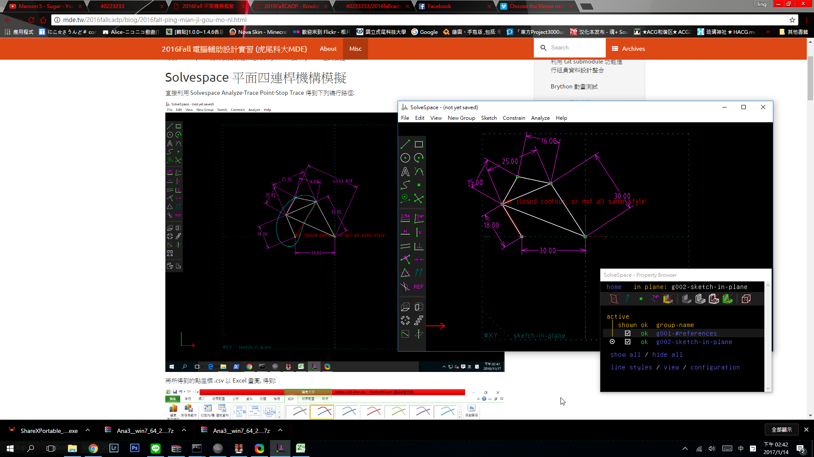
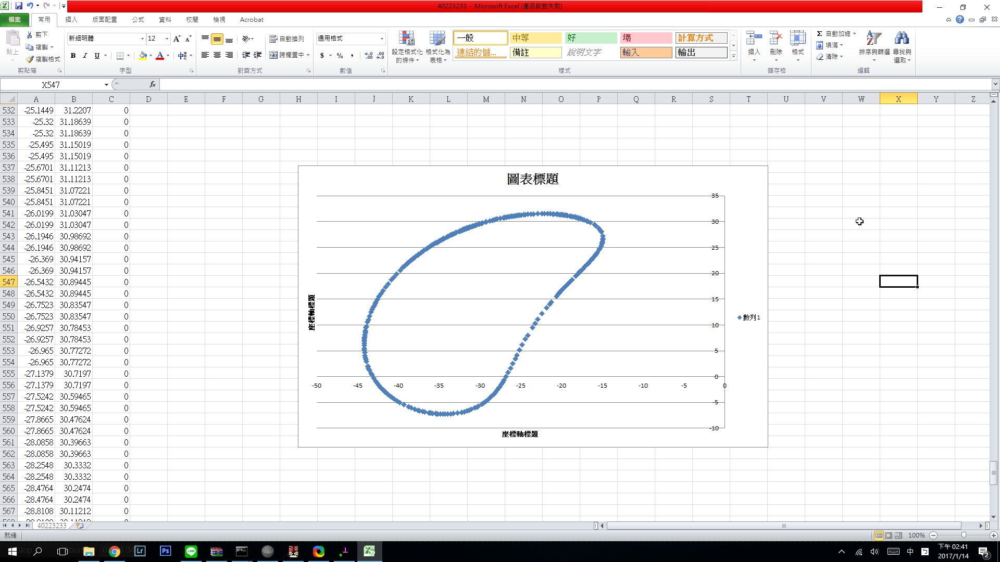

Title: 2016Fall Solvespace 平面四連桿機構模擬 40223233
Date: 2017-01-14 15:00
Category: Misc
Tags: 練習
Author: 40223233

Solvespace平面四連桿機構模擬

座標位置使用excel 繪製

<!-- PELICAN_END_SUMMARY -->

<a href="https://vimeo.com/199426890">影片網址Pt1</a>

<a href="https://vimeo.com/199427074">影片網址Pt2</a>
