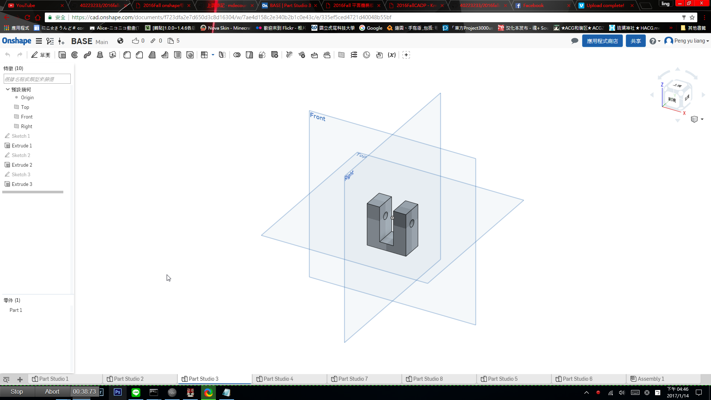

Title: 2016Fall onshape零組件繪製
Date: 2016-12-30 11:36
Category: Misc
Tags: 練習
Author: 40223233

立用協同的方式跟組員分工合作

<!-- PELICAN_END_SUMMARY -->

零件圖

組合件圖

影片說明:<a href="https://vimeo.com/199431577">影片網址Pt1</a>
                 <a href="https://vimeo.com/199432088">影片網址Pt1</a>

網址連結:
<a href="https://cad.onshape.com/documents/f723dfa2e7d650d3c8d16304/w/7ae4d158c2e340b2b1c0e43c/e/e8d9ea50e2cb1fdf85595f27">Onshape 分組  組合件</a>
